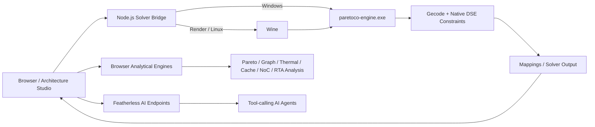

# ParetoCo

**Analytical Design Space Exploration, Architecture Analysis, and Multi-Objective Optimization for heterogeneous computing systems.**

ParetoCo is a computational-research platform for exploring mappings of streaming/dataflow workloads onto heterogeneous processor architectures. It combines a packaged **native Gecode-based solver**, interactive architecture modeling, browser-side analytical algorithms, Pareto analysis, continuous/incremental DSE, system profiling, and Featherless-powered AI assistance.

The native solver in this distribution is shipped as a compiled **64-bit Windows executable** with its runtime DLLs. On Windows it runs directly. On Render/Linux it runs through **Wine**, so the hosted application still executes the same packaged native solver instead of silently substituting a mock solver.

---

## Why ParetoCo

Architecture design is rarely a single-objective problem. A configuration that improves throughput can increase power, cost, memory pressure, thermal load, or communication contention. ParetoCo turns those trade-offs into an explorable design space:

1. Model a hardware platform and SDF-style workload.
2. Define WCETs and design constraints.
3. Run the packaged native constraint engine.
4. Inspect feasible mappings and non-dominated solutions.
5. Analyze bottlenecks, sensitivity, schedulability, thermal behavior, memory behavior, NoC behavior, and reliability.
6. Modify the architecture and repeat with incremental/warm-start assistance.
7. Use Featherless agents for natural-language modeling, design interpretation, optimization guidance, and UNSAT repair assistance.

---

## Production Architecture



### Native execution policy

- **Windows:** `paretoco-engine.exe` is launched directly.
- **Render/Linux:** `paretoco-engine.exe` is launched through Wine.
- **Production Render deployment:** `PARETOCO_REQUIRE_NATIVE=true` is enabled. If the executable or Wine is unavailable, `/healthz` becomes unhealthy and `/api/launch` reports a native-engine error instead of presenting an analytical fallback as the native result.
- The browser analytical engines remain useful for visualization, diagnostics, previews, and additional analyses, but they are not presented as a replacement for the production native solver.

---

# Feature Inventory

## 1. Native Design Space Exploration Engine

The packaged `paretoco-engine.exe` provides the native optimization path used by `/api/launch`.

Capabilities represented in the packaged engine include:

- Gecode-backed constraint search and branch-and-bound optimization
- Synchronous Dataflow (SDF) workload parsing
- heterogeneous processing-element mapping
- processor assignment and scheduling constraints
- TDMA/interconnect allocation constraints
- throughput constraints
- power, cost, memory, and mapping constraints
- configurable DSE objectives/search strategies
- MCR and SSE throughput-propagation modes
- presolver support
- solution enumeration and result-file generation

The required Windows runtime libraries are kept together under `paretoco-engine-release/` so both direct Windows execution and Wine execution can resolve the native dependencies.

## 2. Interactive Architecture Studio

The browser-based Architecture Studio supports visual platform/workload construction and manipulation:

- processor and architecture-node creation
- workload/application node creation
- interactive edges and ports
- drag/drop editing
- zooming, panning, selection, and property inspection
- automatic layout
- model-to-canvas and canvas-to-model synchronization
- result overlays on the modeled architecture
- separate platform and workload views

## 3. Pareto and Multi-Objective Analysis

`ui/pareto_engine.js` and `ui/pareto_frontier.js` provide:

- Pareto dominance testing
- Deb-style fast non-dominated sorting
- crowding-distance calculation
- hard solution capping for interactive analysis
- 2D hypervolume calculation
- knee-point scoring/detection
- normalized k-means clustering of solutions
- interactive Pareto scatter visualization
- constraint filtering
- solution inspection and dominance explanations
- sensitivity analysis
- parallel-coordinate visualization

## 4. Continuous / Incremental DSE

ParetoCo tracks how architecture or workload edits affect previous exploration results:

- semantic platform differencing
- workload differencing
- constraint differencing
- dependency/invalidation graphs
- impact classification
- warm-start seed synthesis from compatible previous mappings
- exploration branches and run history
- browser-side session persistence
- model fingerprints
- run timelines and delta visualization
- LRU-style session retention

## 5. SDF and Throughput Analytics

`ui/analytical_engine.js` provides compact analytical components for fast inspection:

- Maximum Cycle Ratio analysis using a Howard-style policy-iteration approach
- critical-cycle identification
- throughput estimation from the cycle ratio
- self-timed SDF-style execution simulation
- token-state evolution
- actor firing/event traces
- average simulated iteration period

## 6. Architecture and Graph Algorithms

`ui/arch_engine.js` includes reusable architecture-analysis primitives:

- directed graph representation
- Tarjan strongly connected components
- simple-cycle discovery
- topological sorting
- Dijkstra shortest paths
- Floyd-Warshall all-pairs shortest paths
- Dinic maximum flow
- disjoint-set union
- critical-path / schedule-float analysis
- mesh NoC generation
- XY routing
- NoC link utilization and saturation analysis
- steady-state thermal estimation
- DVFS operating-point curve estimation
- L1/L2 cache hierarchy simulation
- TDMA slot allocation

## 7. Advanced Optimization and System Analysis

`ui/advanced_algorithms.js` adds higher-level computational analysis:

- DVFS energy / energy-delay optimization
- DVFS transition-overhead estimation
- scratchpad-memory allocation
- NUMA/bank-contention estimation
- fixed-priority response-time analysis
- real-time schedulability checks
- task reliability estimation
- primary/backup scheduling support
- system MTTF estimation
- SPEA2 fitness calculation
- inverted generational distance (IGD)
- NoC wormhole/virtual-channel contention simulation
- simplex-based exact optimization primitive

## 8. System Profiler

`ui/system_profiler.js` provides:

- transient thermal simulation using RK4 integration
- communication-vs-computation roofline/bottleneck analysis
- critical-cycle slack and schedule-float analysis
- MESI-style cache-coherence simulation
- snooping/bus transaction accounting
- invalidation and coherence-overhead metrics

## 9. UNSAT Diagnosis and Repair Assistance

`ui/unsat_engine.js` provides deterministic local diagnostics:

- QuickXplain-style minimal-conflict extraction
- feasibility checks
- constraint slack quantification
- period/power violation identification
- repair synthesis such as period relaxation, processor scaling, or power-budget expansion

The web UI also exposes a Featherless-assisted UNSAT Doctor endpoint for conversational repair guidance.

## 10. Featherless AI Features

The integrated AI layer is deliberately kept separate from the mathematical solver. It uses Featherless through an OpenAI-compatible API client and bounded tool-calling loops.

Integrated endpoints/features:

- **AI Insights** — summarizes active DSE results and trade-offs
- **Natural Language → DSE** — converts a natural-language architecture request into structured platform/workload/WCET/constraint/DSE JSON
- **Auto Optimize** — agent-guided architecture modification workflow
- **UNSAT Doctor** — agent-guided repair suggestions for infeasible designs

Set `FEATHERLESS_API_KEY` to enable these cloud AI features. The native DSE engine itself does not require this key.

## 11. Project Import, Export, and Visualization

The main dashboard also includes:

- platform XML parsing/generation
- SDF XML parsing and graph visualization
- WCET XML parsing
- design-constraint parsing/generation
- DSE config parsing/preview
- native result parsing
- KPI summaries
- results charts
- local project persistence/autosave
- full-project export
- built-in demo presets

---

# Repository Layout

```text
ParetoCo/
├── server.js                       # HTTP server + native solver bridge
├── Dockerfile                      # Render/Linux image with Wine
├── render.yaml                     # Render Blueprint
├── package.json
├── .env.example
│
├── paretoco-engine-release/        # Required packaged native engine
│   ├── paretoco-engine.exe
│   └── *.dll
│
├── ui/                             # Dashboard + analytical engines
│   ├── index.html
│   ├── app.js
│   ├── architecture_studio.js
│   ├── pareto_frontier.js
│   ├── incremental_dse.js
│   ├── analytical_engine.js
│   ├── dse_engine.js
│   ├── pareto_engine.js
│   ├── arch_engine.js
│   ├── unsat_engine.js
│   ├── advanced_algorithms.js
│   └── system_profiler.js
│
├── ai_features/                    # Integrated Featherless agents only
│   ├── featherless.js
│   ├── nl_to_model.js
│   ├── auto_optimize.js
│   └── unsat_doctor.js
│
├── benchmarks/                     # H.264, Sobel, Susan workloads
│
└── tests/
    ├── run_30_tests.py             # Native .exe regression runner
    ├── expected_30.json            # Portable expected outcomes
    └── fixtures/generated/
        ├── run_0/
        ├── ...
        └── run_29/
```

The repository intentionally does **not** include an unused Rust wrapper, stale native-source build instructions, duplicate release archives, historical failure logs, generated AI output, or the previous large repeated JS class blocks.

---

# Local Run

## Windows

Requirements:

- Node.js 18+
- the included `paretoco-engine-release/` directory
- Python 3 only if you want to run the 30-case native regression suite

Install the integrated AI dependencies:

```bash
npm ci --prefix ai_features
```

Optional AI configuration:

```bash
copy .env.example .env
```

Then set:

```text
FEATHERLESS_API_KEY=your_key_here
```

Start ParetoCo:

```bash
npm start
```

Open:

```text
http://localhost:8080
```

Check the native bridge:

```text
http://localhost:8080/api/status
```

On Windows the status should report `native-windows`.

## Linux

Install Node.js 18+ and Wine. The server automatically detects `wine64` or `wine` and uses it to launch the packaged executable.

You can force a Wine executable with:

```bash
PARETOCO_WINE=/usr/bin/wine npm start
```

For production-like behavior locally:

```bash
PARETOCO_REQUIRE_NATIVE=true npm start
```

---

# Render Deployment

ParetoCo should be deployed to Render as a **Docker Web Service**, not as Render's plain Node runtime, because the production solver artifact is a Windows x86-64 executable.

The included `Dockerfile`:

1. starts from a Debian-based Node.js image;
2. installs Wine/Wine64;
3. installs the Featherless client dependencies;
4. copies the native `.exe` and DLLs;
5. enables `PARETOCO_REQUIRE_NATIVE=true`;
6. initializes a 64-bit Wine prefix;
7. starts `server.js` on Render's web port.

The included `render.yaml` is a Render Blueprint for this Docker deployment.

### Deploy

1. Push this cleaned repository to GitHub.
2. In Render, create a Blueprint/Web Service from the repository.
3. Render should detect `render.yaml` and build the included `Dockerfile`.
4. Add `FEATHERLESS_API_KEY` as a secret environment variable if you want AI features.
5. Deploy.
6. Verify `/healthz` and `/api/status` after deployment.

A healthy Render deployment should report a native engine similar to:

```json
{
  "status": "ready",
  "nativeRequired": true,
  "nativeEngine": "paretoco-engine.exe via wine",
  "executionMode": "wine"
}
```

If Wine or the executable is unavailable, the production health endpoint returns an error instead of disguising the failure with a fallback solver.

---

# Native 30-Run Regression Suite

The new regression suite is wired directly to the packaged executable:

```bash
python tests/run_30_tests.py
```

Run selected cases:

```bash
python tests/run_30_tests.py 1,2,3
```

Or through npm:

```bash
npm test
npm run test:smoke
```

### What the runner does

- resolves `paretoco-engine-release/paretoco-engine.exe`
- launches it directly on Windows
- launches the **same executable through Wine** on Linux
- runs from each fixture directory so relative SDF/platform paths remain valid
- invokes the engine with `--config config.cfg`
- compares exit status and solution count with `tests/expected_30.json`
- allows historical timeout cases either to time out again or to complete successfully with the expected result
- writes a machine-readable `tests/run_30_results.json` report

Override the engine or Wine executable if required:

```bash
PARETOCO_ENGINE=/path/to/paretoco-engine.exe python tests/run_30_tests.py
PARETOCO_WINE=/usr/bin/wine python tests/run_30_tests.py
```

Only the 30 fixture directories required by this suite are retained; the unused generated runs from the previous repository were removed.

---

# API

| Endpoint | Method | Purpose |
|---|---:|---|
| `/healthz` | GET | Deployment health + native-engine availability |
| `/api/health` | GET | Same health information for API clients |
| `/api/status` | GET | Runtime, architecture, engine path/mode |
| `/api/presets` | GET | Built-in DSE demo presets |
| `/api/launch` | POST | Generate inputs and execute the native DSE engine |
| `/api/ai/insights` | POST | Featherless DSE/result interpretation |
| `/api/ai/nl-to-dse` | POST | Natural-language request to structured DSE model |
| `/api/ai/auto-optimize` | POST | AI-guided architecture optimization workflow |
| `/api/ai/unsat-doctor` | POST | AI-guided infeasibility repair workflow |

---

# Benchmarks

The cleaned repository retains three representative computational workloads:

- H.264 video pipeline
- Sobel filter
- Susan edge/corner detector

Each benchmark retains the configuration and XML/SDF files used by its model; redundant duplicate `platform.xml` copies were removed.

---

# Technical Foundations

ParetoCo's implementation draws on established algorithms and methods including:

- constraint programming with Gecode
- Synchronous Dataflow modeling
- Maximum Cycle Ratio / maximum-cycle-mean analysis
- self-timed dataflow execution
- Pareto dominance and non-dominated sorting
- SPEA2 multi-objective optimization metrics
- QuickXplain-style conflict isolation
- fixed-priority response-time analysis
- Dijkstra, Floyd-Warshall, Tarjan SCC, Dinic max-flow, and critical-path analysis
- mesh NoC XY routing and wormhole-contention modeling
- DVFS/energy modeling
- thermal RC modeling and RK4 transient integration
- cache hierarchy and MESI-style coherence modeling

### Selected references

- E. A. Lee and D. G. Messerschmitt, “Synchronous Data Flow,” *Proceedings of the IEEE*, 1987.
- K. Deb et al., “A Fast and Elitist Multiobjective Genetic Algorithm: NSGA-II,” *IEEE Transactions on Evolutionary Computation*, 2002.
- E. Zitzler, M. Laumanns, and L. Thiele, “SPEA2: Improving the Strength Pareto Evolutionary Algorithm,” 2001.
- U. Junker, “QUICKXPLAIN: Preferred Explanations and Relaxations for Over-Constrained Problems,” AAAI, 2004.
- M. Joseph and P. Pandya, “Finding Response Times in a Real-Time System,” *The Computer Journal*, 1986.
- Gecode — generic constraint development environment: https://www.gecode.org/

---

# Security and Secrets

Do not commit `.env` or API keys. Render secrets should be configured through the service environment. `.env.example` contains only variable names and safe placeholders.

---

# License

MIT License. See [LICENSE](LICENSE).
