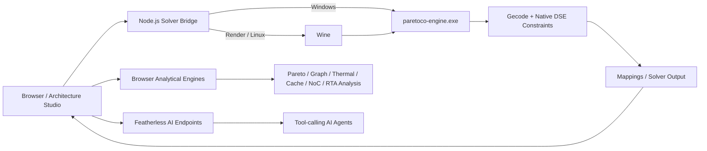

# ParetoCo

**Analytical Design Space Exploration, Architecture Analysis, and Multi-Objective Optimization for heterogeneous computing systems.**

ParetoCo is a computational-research platform for exploring mappings of streaming/dataflow workloads onto heterogeneous processor architectures. It combines a packaged **native Gecode-based solver**, interactive architecture modeling, browser-side analytical algorithms, Pareto analysis, continuous/incremental DSE, system profiling, and Featherless-powered AI assistance.

The native solver in this distribution is shipped as a compiled **64-bit Windows executable** with its runtime DLLs. On Windows it runs directly. On Render/Linux it runs through **Wine**, so the hosted application still executes the same packaged native solver instead of silently substituting a mock solver.

---

## Why ParetoCo

Architecture design is rarely a single-objective problem. A configuration that improves throughput can increase power, cost, memory pressure, thermal load, or communication contention. ParetoCo turns those trade-offs into an explorable design space:

1. Model a hardware platform and SDF-style workload.
2. Define WCETs and design constraints.
3. Run the packaged native constraint engine.
4. Inspect feasible mappings and non-dominated solutions.
5. Analyze bottlenecks, sensitivity, schedulability, thermal behavior, memory behavior, NoC behavior, and reliability.
6. Modify the architecture and repeat with incremental/warm-start assistance.
7. Use Featherless agents for natural-language modeling, design interpretation, optimization guidance, and UNSAT repair assistance.

---

## Production Architecture

### Native execution policy

- **Windows:** `paretoco-engine.exe` is launched directly.
- **Render/Linux:** `paretoco-engine.exe` is launched through Wine.
- **Production Render deployment:** `PARETOCO_REQUIRE_NATIVE=true` is enabled. If the executable or Wine is unavailable, `/healthz` becomes unhealthy and `/api/launch` reports a native-engine error instead of presenting an analytical fallback as the native result.
- The browser analytical engines remain useful for visualization, diagnostics, previews, and additional analyses, but they are not presented as a replacement for the production native solver.

---

# Feature Inventory

## 1. Native Design Space Exploration Engine

The packaged `paretoco-engine.exe` provides the native optimization path used by `/api/launch`.

Capabilities represented in the packaged engine include:

- Gecode-backed constraint search and branch-and-bound optimization
