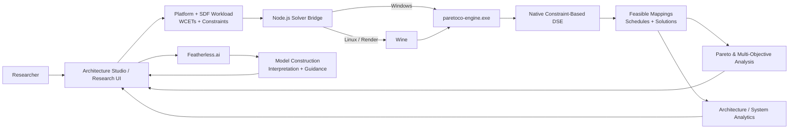

# ParetoCo

### **From an architecture idea to a computational experiment.**

**ParetoCo is an AI-assisted research environment for heterogeneous computer-architecture Design Space Exploration (DSE).** It combines a packaged native constraint solver, Synchronous Dataflow (SDF) workload modeling, Pareto optimization, interactive architecture construction, system-level analytical models, incremental experimentation, and Featherless.ai-assisted model creation and interpretation.

> **AI does not invent the optimum. ParetoCo uses deterministic/native computation to explore feasible designs; AI helps researchers formulate, navigate, and understand the experiment.**

**Impact Forge Track:** Computational Research
**Team:** Muhammad Taha Bin Zaeem · Alizay Hasan · Lameea Mubashir Khan · Idrees Babar
**Submission:** [ParetoCo on Devpost](https://devpost.com/software/paretoco)

---

## The Problem

Modern computing systems are increasingly **heterogeneous**.

A single architecture may combine:

**CPUs · GPUs · DSPs · NPUs · accelerators · memory systems · buses · Networks-on-Chip**

A researcher then has to answer interconnected questions:

* Which processor should execute each task?
* How many processing elements are necessary?
* Which mapping and schedule satisfy timing constraints?
* What happens to **power, latency, throughput, cost, area, and memory**?
* Does adding an accelerator still help once communication is considered?
* Which solutions remain optimal when requirements change?
* Why did a previously feasible architecture become infeasible?

Even a relatively small number of architectural decisions can create a design space too large to inspect manually.

**ParetoCo turns that search into a repeatable computational workflow:**

### **Model → Constrain → Solve → Compare → Explain → Iterate**

---

# How ParetoCo Works



The architecture deliberately separates three responsibilities:

| Layer                                | Responsibility                                                                                |
| ------------------------------------ | --------------------------------------------------------------------------------------------- |
| **Native DSE engine**                | Feasibility, mappings, scheduling, constraint-based search and solution enumeration           |
| **Deterministic analytical engines** | Pareto, graph, SDF, NoC, thermal, cache, real-time, reliability and diagnostic analysis       |
| **Featherless.ai**                   | Natural-language model construction, clarification, result interpretation and design guidance |

This separation is important for research use:

**the language model assists the researcher; it is not treated as the mathematical source of truth.**

---

# The Computational Core

ParetoCo's primary exploration path invokes the packaged **64-bit native DSE engine** rather than generating artificial results in the browser.

The native path supports:

* **Gecode-backed constraint search**
* **heterogeneous processing-element mapping**
* **SDF workload parsing**
* **processor assignment**
* **scheduling constraints**
* **TDMA/interconnect constraints**
* **throughput constraints**
* **power constraints**
* **cost and memory constraints**
* **mapping/resource constraints**
* **multiple DSE objectives and search strategies**
* **MCR and SSE throughput-propagation modes**
* **presolving**
* **solution enumeration**
* **native result-file generation**

On Windows:

```text
Node.js → paretoco-engine.exe
```

On the hosted Linux/Render path:

```text
Node.js → Wine → paretoco-engine.exe
```

Production mode can require native execution with:

```bash
PARETOCO_REQUIRE_NATIVE=true
```

If the executable or Wine cannot be resolved, ParetoCo reports a **native-engine failure** rather than silently labeling a browser-side approximation as a native solver result.

---

# Multi-Objective Research Instead of One "Best" Design

There is rarely one universally best computer architecture.

A solution may improve latency while increasing power.
Reducing cost may sacrifice throughput.
Additional accelerators may increase communication or thermal pressure.

ParetoCo therefore treats architecture selection as a **multi-objective problem**.

Solutions can be investigated across metrics including:

**Latency · Throughput · Power · Area · Cost · Utilization · Processor Count · Memory**

The Pareto stack includes:

* Pareto dominance
* fast non-dominated sorting
* crowding distance
* 2D hypervolume
* knee-point scoring
* normalized solution clustering
* sensitivity analysis
* interactive constraint filtering
* dominance explanations
* parallel-coordinate visualization

Rather than asking:

> **Which architecture wins?**

ParetoCo lets the researcher ask:

> **What does each improvement cost, which designs are non-dominated, and where is the most useful trade-off?**

---

# Interactive Architecture Studio

The research model can also be manipulated visually.

Architecture Studio supports components including:

**CPU · GPU · DSP · NPU · accelerator · memory · NoC · bus · workload actor**

Researchers can:

* create and connect architecture components,
* manipulate nodes and edges,
* zoom and pan,
* inspect properties,
* switch between platform and workload representations,
* automatically lay out models,
* synchronize visual and underlying model representations,
* and project solver mappings onto the modeled architecture.

This is intended to reduce the distance between:

**the system a researcher imagines**
and
**the model the computational engine evaluates**.

---

# Research Analysis Stack

The native solver finds candidate architectures.

ParetoCo's analytical layer helps investigate **why those architectures behave differently**.

| Research area             | Implemented analysis                                                                             |
| ------------------------- | ------------------------------------------------------------------------------------------------ |
| **Dataflow / Throughput** | Maximum Cycle Ratio, critical-cycle extraction, throughput estimation, self-timed SDF simulation |
| **Graph Structure**       | Tarjan SCC, cycle discovery, topological sort, Dijkstra, Floyd-Warshall, Dinic max-flow          |
| **Scheduling**            | Critical Path Method, earliest/latest timing, total/free float                                   |
| **NoC**                   | 2D mesh generation, XY routing, link load, saturation and simplified contention analysis         |
| **Energy**                | DVFS operating points, energy estimation, energy-delay reasoning                                 |
| **Thermal**               | Steady-state thermal estimation and transient RC simulation with RK4 integration                 |
| **Memory**                | L1/L2 cache simulation, scratchpad allocation, NUMA/bank contention                              |
| **Coherence**             | MESI-style states, invalidations and bus/coherence transaction accounting                        |
| **Performance**           | Roofline-style communication-vs-computation analysis                                             |
| **Real-Time**             | Fixed-priority response-time and schedulability analysis                                         |
| **Reliability**           | Failure/reliability estimation, primary/backup reasoning and estimated MTTF                      |
| **Multi-objective**       | SPEA2-style fitness metrics and IGD                                                              |
| **Optimization**          | Simplex-based LP primitive                                                                       |
| **Diagnostics**           | Constraint slack analysis and QuickXplain-style conflict isolation                               |

<details>
<summary><strong>Detailed implemented feature inventory</strong></summary>

### Architecture / Graph Engine

* directed graph representation
* binary min-heap
* disjoint-set union
* Tarjan strongly connected components
* simple-cycle discovery
* topological sorting
* Dijkstra shortest paths
* Floyd-Warshall all-pairs shortest paths
* Dinic maximum flow
* critical-path calculation
* schedule-float analysis
* mesh NoC construction
* deterministic XY routing
* NoC saturation analysis
* steady-state thermal estimation
* DVFS curve estimation
* L1/L2 cache hierarchy simulation
* TDMA allocation

### SDF / Analytical Engine

* Maximum Cycle Ratio analysis
* Howard-style policy iteration
* critical-cycle identification
* throughput derivation
* self-timed execution simulation
* token-state tracking
* actor firing traces
* iteration-period estimation

### Advanced System Analysis

* DVFS energy optimization
* transition-overhead estimation
* scratchpad-memory allocation
* NUMA/bank-contention estimation
* fixed-priority response-time analysis
* real-time schedulability
* reliability estimation
* primary/backup analysis
* approximate system MTTF
* SPEA2-style fitness
* Inverted Generational Distance
* simplified wormhole/virtual-channel contention
* Simplex LP optimization

### System Profiler

* transient thermal RC simulation
* fourth-order Runge-Kutta integration
* arithmetic-intensity / Roofline reasoning
* computation-vs-communication bottleneck analysis
* critical-cycle slack
* MESI-style cache coherence
* snooping/bus transaction tracking

### Pareto Analysis

* dominance testing
* non-dominated sorting
* crowding distance
* hypervolume
* knee scoring
* k-means solution grouping
* solution filtering
* sensitivity analysis
* parallel-coordinate visualization

</details>

---

# Featherless.ai: AI as a Research Assistant

A central goal of ParetoCo is to explore how AI can make architecture research **more accessible without replacing deterministic evaluation**.

The Featherless integration uses an OpenAI-compatible client and a bounded tool-calling agent loop.

## Natural Language → DSE

A user can begin with a research requirement such as:

> *Use four CPU cores and two NPUs, place the vision workload on accelerators, keep latency below 30 ms, and prioritize energy efficiency.*

The AI pipeline can translate this into structured:

* platform definitions,
* application/workload descriptions,
* WCET information,
* constraints,
* and DSE configuration.

Its tools can validate a proposed platform and request clarification when required information is missing.

The resulting structure can then enter the normal computational workflow.

```text
Research idea
      ↓
Featherless-assisted model construction
      ↓
Structured DSE model
      ↓
Native / deterministic exploration
      ↓
Measured solutions
      ↓
Featherless-assisted interpretation
```

## AI Insights

Actual exploration results can be passed to the AI layer to help explain:

* performance/power trade-offs,
* candidate solutions,
* mappings,
* potential bottlenecks,
* and follow-up experiments.

## Optimization & UNSAT Guidance

ParetoCo also contains AI-assisted architecture modification and infeasibility-repair workflows.

**Important research boundary:** AI-generated modifications and repair suggestions are **proposals**. A native DSE rerun remains the verification step before a proposed architecture should be treated as feasible.

That boundary is intentional.

---

# Continuous DSE: Research Is Iterative

A single solver run is rarely a complete experiment.

Researchers repeatedly alter:

* architectures,
* workloads,
* processor counts,
* constraints,
* power budgets,
* and timing assumptions.

ParetoCo therefore includes an incremental experimentation layer with:

* persistent exploration sessions,
* model snapshots,
* run history,
* semantic platform differencing,
* workload differencing,
* constraint differencing,
* parameter-change detection,
* LOW / MEDIUM / HIGH impact classification,
* invalidation dependency graphs,
* new/invalidated solution tracking,
* Pareto-front evolution,
* model fingerprints,
* experiment branches,
* and **browser-side warm-start seed synthesis**.

This enables questions such as:

> *What changed between experiment 8 and experiment 9?*

> *Which requirement invalidated these mappings?*

> *How did adding an accelerator move the Pareto frontier?*

> *Which architectural choices remain stable across experiments?*

Native warm-start consumption is a **future extension**; the current implementation synthesizes and tracks compatible seed candidates at the research-workflow layer.

---

# Why This Is Useful for Research

ParetoCo is designed for researchers, students, and architecture developers who need to explore **interacting system decisions** rather than optimize one metric in isolation.

Possible experiments include:

### CPU–GPU–NPU Co-Design

Compare heterogeneous resource combinations under common:

* timing,
* power,
* cost,
* memory,
* and communication constraints.

### Communication-Aware Accelerator Mapping

Investigate when additional accelerators stop improving end-to-end performance because **data movement becomes the bottleneck**.

### Thermal-Aware DSE

Study whether mappings that look attractive in power/performance space remain attractive after transient thermal behavior is considered.

### Memory-Aware Mapping

Compare task mappings while also reasoning about cache, scratchpad, NUMA and coherence behavior.

### Reliability-Aware Optimization

Explore trade-offs between:

**performance · resource duplication · reliability · cost**

### Explainable Infeasibility

Study not only *whether* a design is infeasible, but:

**which constraints create the conflict and what minimal changes might restore feasibility.**

### Human–AI Architecture Research

Evaluate whether an AI research assistant can reduce:

* model-construction time,
* configuration errors,
* and expertise barriers,

while keeping the final feasibility decision in a deterministic computational engine.

---

# Research Lineage

ParetoCo does not claim to replace mature architecture-research frameworks. It builds on a long history of **system-level modeling and Design Space Exploration** and experiments with bringing several normally separate stages of that workflow into one interactive environment.

## Sesame / System-Level MPSoC Exploration

Research around **Sesame** demonstrated the value of high-level system modeling and systematic exploration for heterogeneous MPSoC architectures.

This line of work separated application and architecture concerns so mappings and system-level trade-offs could be investigated before committing to low-level implementation.

**Where ParetoCo fits:** an interactive layer that combines model construction, native exploration, Pareto analysis, architecture visualization, additional system analyses and experiment history.

---

## IDeSyDe — Design Space Identification

**IDeSyDe** approaches DSE systematically through *Design Space Identification*, constructing modular and tuneable exploration solutions from different models.

That work highlights an important research problem: as heterogeneous systems become more complex, simply having an optimizer is not enough—the design space itself must be identified and structured correctly.

**ParetoCo explores a complementary direction:** making formulation and iteration more interactive through visual modeling, deterministic analytical engines and AI-assisted model construction.

A future integration between **formal design-space identification** and an interactive environment like ParetoCo would be particularly interesting.

---

## FARSI — Domain-Specific SoC Exploration

**FARSI** studies early-stage exploration of domain-specific SoCs, where specialized components and many architectural knobs create very large design spaces.

Its results demonstrate why architectural reasoning, bottleneck analysis and early exploration matter when dealing with heterogeneous systems.

**ParetoCo's related goal** is to make this style of exploratory reasoning accessible from one research interface while exposing additional analytical dimensions such as NoC, memory, thermal, scheduling and reliability behavior.

ParetoCo does not claim FARSI's calibrated accuracy or convergence results; the relationship is one of **research motivation and workflow direction**.

---

## Stream — Heterogeneous Dataflow Accelerators

**Stream** explores layer-fused DNN mappings on heterogeneous dataflow accelerators and jointly considers computation, memory and communication.

This illustrates an important principle behind ParetoCo:

> **The fastest compute resource is not necessarily the best system mapping once communication and memory are included.**

ParetoCo approaches the broader problem through generic heterogeneous architecture/SDF modeling and an extensible set of system-level analyses.

---

## EtoE-DSE — End-to-End Constraints

**EtoE-DSE** demonstrates the importance of optimizing complex multi-component systems under **end-to-end latency constraints**, rather than optimizing individual components independently.

ParetoCo's graph, scheduling, path, latency and Pareto-analysis infrastructure provides a foundation for experiments in the same broader direction: reasoning about architectural decisions as **whole-system interactions**.

---

## LLM-Assisted DSE

Recent work such as **SECDA-DSE** has started investigating LLM-guided hardware Design Space Exploration for FPGA accelerators.

This makes the interaction between **language models and deterministic hardware evaluation** an active research direction.

ParetoCo takes a deliberately conservative architecture:

> **use the LLM to formulate, clarify and interpret; use computational tools to verify.**

This creates an interesting future research question:

### *Can AI reduce the expertise and time needed to formulate DSE experiments without reducing confidence in the mathematical result?*

---

# Why We Built ParetoCo

ParetoCo was built by:

* **Muhammad Taha Bin Zaeem**
* **Alizay Hasan**
* **Lameea Mubashir Khan**
* **Idrees Babar**

For **Muhammad Taha Bin Zaeem, a second-year Computer Engineering student**, one motivation was the gap between *learning* concepts such as architecture, scheduling, dataflow, memory systems and optimization—and being able to **experiment with all of them together**.

The question became:

> **How can we turn an architecture idea into a computational experiment instead of only reasoning about it theoretically?**

ParetoCo lets us investigate questions such as:

* When does adding another accelerator stop helping?
* How much power must be traded for lower latency?
* When does the network become the bottleneck?
* Which mappings remain Pareto-optimal after a constraint changes?
* Why does a previously feasible design become impossible?

For us, ParetoCo is both a software project and a platform for **learning research by performing research experiments**.

---

# Reproducibility

ParetoCo works with explicit models and files rather than hidden prompts alone.

Supported research inputs/outputs include:

* platform XML,
* SDF/XML workload models,
* WCET XML,
* design constraints,
* DSE configuration,
* native TXT results,
* CSV results,
* project persistence/export.

The repository retains three representative computational workloads:

* **H.264 video pipeline**
* **Sobel filter**
* **SUSAN edge/corner detector**

These provide small reproducible starting points for architecture and streaming-workload experiments.

---

# Quick Start

## Requirements

### Windows

* **Node.js 18+**
* included `paretoco-engine-release/`
* Python 3 only for the native regression suite

### Linux

* Node.js 18+
* Wine / Wine64
* included native engine and DLL directory

### AI Features

Featherless is optional.

The native DSE engine does **not** require a Featherless API key.

---

## 1. Clone

```bash
git clone https://github.com/MuhammadTahaBinZaeem/ParetCo.git
cd ParetCo
```

## 2. Install AI-layer dependencies

```bash
npm ci --prefix ai_features
```

## 3. Optional: Configure Featherless

Create `.env` from `.env.example`.

Windows:

```powershell
copy .env.example .env
```

Linux/macOS shell:

```bash
cp .env.example .env
```

Then set:

```env
FEATHERLESS_API_KEY=your_key_here
FEATHERLESS_MODEL=Qwen/Qwen2.5-7B-Instruct
```

Never commit `.env`.

## 4. Start ParetoCo

```bash
npm start
```

Open:

```text
http://localhost:8080
```

Check the solver bridge:

```text
http://localhost:8080/api/status
```

---

# Linux / Wine

ParetoCo automatically looks for `wine64` or `wine`.

To explicitly select Wine:

```bash
PARETOCO_WINE=/usr/bin/wine npm start
```

To require native execution:

```bash
PARETOCO_REQUIRE_NATIVE=true npm start
```

The same packaged Windows engine is used; Wine is only the compatibility layer.

---

# Render Deployment

ParetoCo includes both:

```text
Dockerfile
render.yaml
```

The Docker image:

1. uses a Debian-based Node image,
2. installs Wine/Wine64,
3. installs the integrated AI dependencies,
4. copies the native executable and DLLs,
5. configures a 64-bit Wine prefix,
6. enables native-required production mode,
7. starts the Node solver bridge.

The relevant production variables are:

```env
PARETOCO_REQUIRE_NATIVE=true
PARETOCO_ENGINE=/app/paretoco-engine-release/paretoco-engine.exe
WINEARCH=win64
```

For AI functionality, add this as a **Render secret**, not to Git:

```env
FEATHERLESS_API_KEY=...
```

After deployment, verify:

```text
/healthz
/api/status
```

A deployment should only be treated as ready when the native engine is reported as available.

---

# Native Regression Suite

ParetoCo contains a **30-case regression harness wired directly to the packaged executable**.

Run every case:

```bash
python tests/run_30_tests.py
```

Selected cases:

```bash
python tests/run_30_tests.py 1,2,3
```

Or:

```bash
npm test
npm run test:smoke
```

The runner:

* locates `paretoco-engine-release/paretoco-engine.exe`,
* executes it directly on Windows,
* executes the same binary through Wine on Linux,
* runs each case from its fixture directory,
* invokes `--config config.cfg`,
* captures stdout/stderr,
* enforces per-run timeouts,
* compares exit status and solution count with expected outcomes,
* and produces a machine-readable JSON report.

Custom engine:

```bash
PARETOCO_ENGINE=/path/to/paretoco-engine.exe python tests/run_30_tests.py
```

Custom Wine executable:

```bash
PARETOCO_WINE=/usr/bin/wine python tests/run_30_tests.py
```

---

# API Surface

| Endpoint                | Method | Purpose                                 |
| ----------------------- | ------ | --------------------------------------- |
| `/healthz`              | GET    | Deployment/native-engine health         |
| `/api/health`           | GET    | API health information                  |
| `/api/status`           | GET    | Runtime and solver execution mode       |
| `/api/presets`          | GET    | Built-in DSE presets                    |
| `/api/launch`           | POST   | Generate native inputs and run DSE      |
| `/api/ai/insights`      | POST   | Interpret DSE results with Featherless  |
| `/api/ai/nl-to-dse`     | POST   | Natural language → structured DSE model |
| `/api/ai/auto-optimize` | POST   | AI-assisted architecture modification   |
| `/api/ai/unsat-doctor`  | POST   | Conversational infeasibility guidance   |

---

# Repository Architecture

```text
ParetoCo/
│
├── server.js
│   └── HTTP API + native solver execution bridge
│
├── paretoco-engine-release/
│   ├── paretoco-engine.exe
│   └── native runtime DLLs
│
├── ui/
│   ├── app.js
│   ├── architecture_studio.js
│   ├── pareto_frontier.js
│   ├── incremental_dse.js
│   ├── analytical_engine.js
│   ├── dse_engine.js
│   ├── pareto_engine.js
│   ├── arch_engine.js
│   ├── advanced_algorithms.js
│   ├── system_profiler.js
│   └── unsat_engine.js
│
├── ai_features/
│   ├── featherless.js
│   ├── nl_to_model.js
│   ├── auto_optimize.js
│   └── unsat_doctor.js
│
├── benchmarks/
│   ├── h264_video_pipeline/
│   ├── sobel_filter/
│   └── susan_edge_detector/
│
├── tests/
│   ├── run_30_tests.py
│   ├── expected_30.json
│   └── fixtures/generated/
│
├── Dockerfile
├── render.yaml
├── package.json
└── .env.example
```

The modular layout keeps the **native execution bridge, visual research environment, deterministic analytical algorithms, AI layer, benchmarks, and regression suite** independently inspectable.

---

# Current Research Boundaries

ParetoCo is a **research prototype**, and we want its claims to remain reproducible.

### Native solver

Used for the principal constraint-based DSE execution path.

### Browser analytical engines

Used for deterministic secondary analysis, visualization and experimentation.

### Featherless agents

Used for model construction, explanation and guidance.

### AI-generated architectures

Must be passed through the native DSE workflow before being treated as solver-verified.

### AI-generated UNSAT repairs

Are suggestions until a native rerun confirms feasibility.

### Incremental warm starts

Compatible seed candidates are currently synthesized at the browser/research-workflow level; direct native warm-start ingestion is future work.

These distinctions are deliberate: **ParetoCo should make AI useful without making experimental provenance ambiguous.**

---

# What's Next

The highest-value extensions are not more isolated dashboard features.

They are tighter experimental loops.

### 1. Closed-Loop AI + Native DSE

```text
AI proposes
   ↓
Native solver verifies
   ↓
ParetoCo analyzes
   ↓
AI interprets
   ↓
Researcher decides
```

### 2. Native Incremental / Warm-Start DSE

Pass compatible prior mappings directly into native exploration and measure how much repeated experiments accelerate.

### 3. Communication-Aware Optimization

Turn calculated NoC behavior into first-class mapping/search feedback.

### 4. Thermal-Aware Pareto Search

Make temperature and thermal headroom optimization dimensions rather than post-analysis only.

### 5. Calibrated Domain Models

Develop validated models for domains such as:

* heterogeneous AI accelerators,
* edge vision,
* robotics,
* streaming DSP,
* and real-time embedded systems.

### 6. Research Experiment Bundles

Export complete provenance:

```text
platform
+ workload
+ WCETs
+ constraints
+ solver configuration
+ native results
+ Pareto set
+ analysis metadata
```

### 7. Human–AI DSE Study

Experimentally measure whether natural-language modeling reduces:

* time-to-valid-experiment,
* modeling mistakes,
* configuration effort,
* and required prior DSE expertise.

---

# Research References

The algorithms and research direction in ParetoCo build on established work in dataflow, embedded-system DSE, multi-objective optimization, real-time analysis, and explainable constraint solving.

### Foundations

**[1] E. A. Lee and D. G. Messerschmitt.**
*Synchronous Data Flow.* Proceedings of the IEEE, 75(9), 1987.
[IEEE](https://ieeexplore.ieee.org/document/1458143/)

**[2] K. Deb, A. Pratap, S. Agarwal, and T. Meyarivan.**
*A Fast and Elitist Multiobjective Genetic Algorithm: NSGA-II.* IEEE Transactions on Evolutionary Computation, 2002.
[DOI: 10.1109/4235.996017](https://doi.org/10.1109/4235.996017)

**[3] U. Junker.**
*QUICKXPLAIN: Preferred Explanations and Relaxations for Over-Constrained Problems.* AAAI, 2004.

**[4] M. Joseph and P. Pandya.**
*Finding Response Times in a Real-Time System.* The Computer Journal, 29(5), 1986.
[Oxford Academic](https://academic.oup.com/comjnl/article-abstract/29/5/390/486162)

**[5] Gecode.**
*Generic Constraint Development Environment.*
[Gecode Project](https://www.gecode.org/)

### Design Space Exploration Research

**[6] C. Erbas, A. D. Pimentel, M. Thompson, and S. Polstra.**
*A Framework for System-Level Modeling and Simulation of Embedded Systems Architectures.* EURASIP Journal on Embedded Systems, 2007.
[DOI: 10.1155/2007/82123](https://doi.org/10.1155/2007/82123)

**[7] R. Jordão, M. Becker, and I. Sander.**
*IDeSyDe: Systematic Design Space Exploration via Design Space Identification.* ACM Transactions on Design Automation of Electronic Systems, 2024.
[DOI: 10.1145/3647640](https://doi.org/10.1145/3647640)

**[8] B. Boroujerdian et al.**
*FARSI: An Early-stage Design Space Exploration Framework to Tame the Domain-specific System-on-chip Complexity.* ACM Transactions on Embedded Computing Systems.
[DOI: 10.1145/3544016](https://doi.org/10.1145/3544016)

**[9] A. Symons et al.**
*Stream: Design Space Exploration of Layer-Fused DNNs on Heterogeneous Dataflow Accelerators.* IEEE Transactions on Computers.
[DOI: 10.1109/TC.2024.3477938](https://doi.org/10.1109/TC.2024.3477938)

**[10] Y. Liao, T. Adegbija, and R. Lysecky.**
*System-Level Design Space Exploration for High-Level Synthesis under End-to-End Latency Constraints.* IEEE Transactions on Computer-Aided Design of Integrated Circuits and Systems.
[DOI: 10.1109/TCAD.2024.3471892](https://doi.org/10.1109/TCAD.2024.3471892)

### Emerging AI-Assisted DSE

**[11] V. Sharma, X. Fu, J. Haris, and J. Cano.**
*LLM-Driven Design Space Exploration of FPGA-based Accelerators.* SECDA-DSE, 2026 preprint.
[arXiv:2605.05920](https://arxiv.org/abs/2605.05920)

These works are cited as **research foundations and related directions**, not as claims that ParetoCo replaces or outperforms their specialized models.

---

# Team

| Contributor                 | GitHub                                                           |
| --------------------------- | ---------------------------------------------------------------- |
| **Muhammad Taha Bin Zaeem** | [@MuhammadTahaBinZaeem](https://github.com/MuhammadTahaBinZaeem) |
| **Alizay Hasan**            | [@alizay-debug](https://github.com/alizay-debug)                 |
| **Lameea Mubashir Khan**    | [@rosseaaq](https://github.com/rosseaaq)                         |
| **Idrees Babar**            | [@meidreesbabar-crypto](https://github.com/meidreesbabar-crypto) |

ParetoCo was developed collaboratively across the **solver integration, analytical engines, architecture interface, AI workflow, testing and deployment** layers.

---

# Security

Do not commit:

```text
.env
API keys
Render secrets
```

Use `.env.example` for local configuration and environment secrets for hosted deployment.

---

# License

MIT License. See [`LICENSE`](LICENSE).

---

## One-Sentence Vision

> **ParetoCo aims to make heterogeneous computer-architecture research more interactive and explainable: formulate the system, computationally explore what is feasible, understand the trade-offs, and iterate—all from one research environment.**
